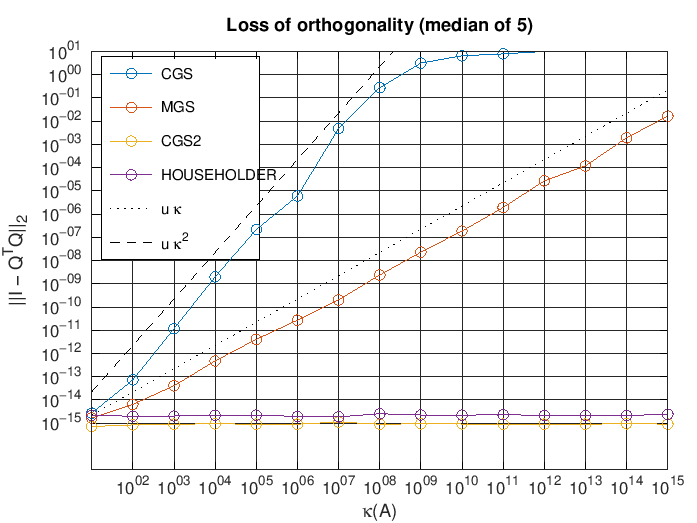
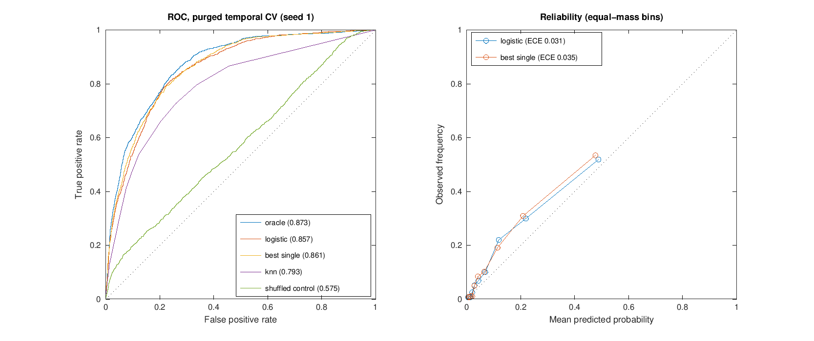
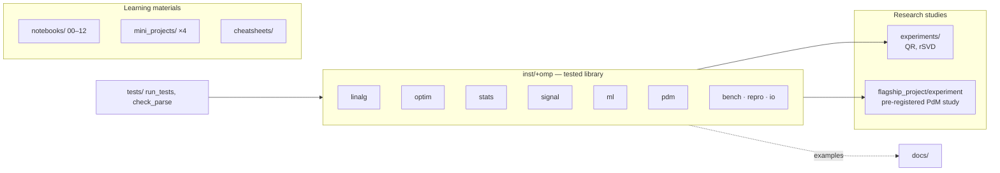

# OctaveMasterPro

**Verified numerical methods, statistical inference and leakage-aware model evaluation for GNU Octave, with a pre-registered simulation study and a hands-on curriculum.**

[-0790c0)](https://octave.org)
[](https://github.com/SatvikPraveen/OctaveMasterPro/actions/workflows/ci.yml)
[](#verification)
[](LICENSE)
[](CITATION.cff)

OctaveMasterPro has three layers:

1. **`omp`**, a namespaced Octave library (installable with `pkg install`).
   Every function is tested against an independent reference: an analytic
   result, a published value, a brute-force definition, a theoretical
   error bound, or a Monte Carlo property with an explicit tolerance.
2. **Research studies** that test stated hypotheses with baselines,
   controls and uncertainty estimates. They report negative results as
   readily as positive ones.
3. **A learning curriculum**: 13 notebooks, four mini-projects and cheat
   sheets that go from Octave basics to parallel computing.

---

## Contents

- [Quick start](#quick-start)
- [The `omp` library](#the-omp-library)
- [Research studies](#research-studies)
- [Flagship study results](#flagship-study-results)
- [Verification](#verification)
- [Repository layout](#repository-layout)
- [Learning materials](#learning-materials)
- [Reproducibility](#reproducibility)
- [Contributing, citation and license](#contributing-citation-and-license)

---

## Quick start

```bash
git clone https://github.com/SatvikPraveen/OctaveMasterPro.git
cd OctaveMasterPro
make check            # 125 library tests + parse check of every .m file
make docs-check       # executes every example in docs/usage_examples.md
```

```octave
addpath inst
omp.repro.env_info ("print");

[x, f, info] = omp.optim.bfgs (@omp.optim.rosenbrock, [-1.2; 1]);
% x = [1; 1] after 38 iterations, 48 function evaluations

[ci, theta] = omp.stats.bootstrap_ci (randn (50, 1) + 1, @mean, "Seed", 1);   % BCa interval
```

**Docker** (pinned Octave 8.4 + JupyterLab, non-root, token-protected):

```bash
docker compose build
JUPYTER_TOKEN=$(openssl rand -hex 16) docker compose up jupyter      # http://127.0.0.1:8888
docker compose run --rm octave-cli make check
```

Native installs, `pkg install` and troubleshooting are covered in
[docs/setup_guide.md](docs/setup_guide.md).

---

## The `omp` library

| Namespace | Functions | Verified against |
|---|---|---|
| `omp.linalg` | `householder_qr`, `gram_schmidt` (CGS / MGS / CGS2), `randomized_svd` | LAPACK factors; orthogonality-loss bounds O(uκ²), O(uκ), O(u); Eckart–Young optimum and the Halko–Martinsson–Tropp bound |
| `omp.optim` | `bfgs`, `line_search_wolfe`, `gradcheck`, `convergence_order`, `rosenbrock` | Strong Wolfe conditions; known minimizers; recovered convergence orders 2 (Newton), φ ≈ 1.618 (secant), 1 (linear) |
| `omp.stats` | `bootstrap_ci` (percentile, BCa), `cluster_bootstrap`, `permutation_test`, `p_adjust`, `effect_size` | Fisher-z interval; simulated coverage and type-I error; R's `p.adjust`; bias of Hedges' g |
| `omp.signal` | `welch_psd` | Parseval; sinusoid power A²/2; analytic AR(1) spectrum; `pwelch` (signal package) to 1e-15 |
| `omp.ml` | `logistic_fit` / `logistic_predict`, `knn_predict`, `roc_auc` (DeLong SE), `average_precision`, `calibration`, `purged_time_splits` | Generating coefficients and KKT conditions; brute-force AUC with ties; DeLong SE vs Monte Carlo SD; scikit-learn AP example; no purge or embargo violations |
| `omp.pdm` | `simulate_fleet`, `causal_features`, `failure_labels` | Hazard–health identity; **causality test** (perturbing the future leaves past features bit-identical); censoring rules |
| `omp.bench` | `timeit`, `amdahl_fit` | Exact recovery of a known serial fraction; monotone timing |
| `omp.repro`, `omp.io` | `seed`, `env_info`, `read_csv` | Stream reproducibility and state restoration; quoting and CRLF handling |

Design conventions:

- **Leakage-safe by construction.** Models store training-set
  standardization, features use past data only, and splits purge rows
  whose label windows overlap the test period.
- **Uncertainty at the right unit.** The cluster bootstrap resamples
  machines, not correlated rows.
- **Isolated randomness.** `"Seed"` options never disturb the caller's
  RNG stream.
- **Help text.** Every function documents its method, defaults,
  assumptions and primary reference (`help omp.ml.roc_auc`).

See [docs/usage_examples.md](docs/usage_examples.md) for executed
examples.

---

## Research studies

Each study states its hypotheses and falsification criteria in the
script header before any results exist, and commits its outputs along
with the environment that produced them.

### 1. Loss of orthogonality vs. conditioning: `experiments/qr_orthogonality.m`

| Method | Fitted slope of log ‖I − QᵀQ‖ vs log κ | Theory | Max backward error |
|---|---|---|---|
| Classical Gram–Schmidt | **2.03** | 2 | 1.4e-16 |
| Modified Gram–Schmidt | **0.94** | 1 | 1.6e-16 |
| CGS with reorthogonalization | **0.00** | 0 | 1.4e-16 |
| Householder | **0.00** | 0 | 1.5e-15 |



The rounding-error theory is confirmed across κ = 10¹ … 10¹⁵. All four
algorithms are backward stable. They differ only in the orthogonality
of Q, which is why MGS is acceptable for least squares but not for
eigenvalue work.

### 2. Randomized SVD accuracy: `experiments/rsvd_accuracy.m`

- **H1 holds.** With no power iterations, the Frobenius error stays
  within the Halko–Martinsson–Tropp expected-error bound (max ratio 1.43
  vs bound 1.80).
- **H2 is falsified as stated.** The hypothesis was that power
  iterations help *slowly* decaying spectra most. In the Frobenius norm
  the largest gain is for fast decay (ratio 1.35 → 1.00); for slow decay
  the optimal tail dominates the error, so the ratio starts near 1
  (1.07). In the spectral norm the prediction holds (1.67 → 1.04).
- **Lesson.** Benefits of power iteration must be stated per norm. See
  [results](experiments/results/rsvd_accuracy.md).

### 3. Flagship: failure prediction against known ground truth: `flagship_project/`

The flagship predicts machine failures within 72 hours.

- **Why a simulation?** A data audit
  ([`data_audit.md`](flagship_project/results/data_audit.md)) found that
  the shipped sensor data cover **29 hours** and contain **no failure
  events**. No predictive claim is identifiable from those files.
- **The simulator.** The study uses a fleet with a latent gamma-process
  degradation state driving the failure hazard. Machines are
  heterogeneous, a shared ambient confounder affects all of them,
  preventive maintenance censors degradation, and some readings are
  missing.
- **The oracle.** Because the latent state is known, a scorer that
  observes it gives a Bayes ceiling against which real models are
  measured.
- **Design.** The full design, hypotheses, controls and protocol are in
  [flagship_project/README.md](flagship_project/README.md).

---

## Flagship study results

5 independent fleets × 40 machines × 120 days. Rows are evaluated
out-of-fold under **purged forward-chaining CV** (prevalence ≈ 13%).
Full tables:
[`summary.md`](flagship_project/results/summary.md) ·
[`metrics_by_seed.csv`](flagship_project/results/metrics_by_seed.csv).

| Model | ROC AUC (mean ± SD, 5 seeds) | Average precision | Brier skill | ECE |
|---|---|---|---|---|
| Oracle: latent health, the Bayes ceiling | **0.843 ± 0.018** | 0.506 | – | – |
| Ridge logistic regression, 13 causal features | **0.822 ± 0.020** | 0.463 | 0.205 | 0.022 |
| Best single feature (selected inside each training fold) | **0.824 ± 0.021** | 0.473 | 0.213 | 0.023 |
| k-NN (k = 25) | 0.765 ± 0.022 | 0.371 | 0.132 | 0.038 |
| Prevalence (zero-information baseline) | 0.505 ± 0.011 | 0.133 | −0.004 | 0.025 |
| Negative control: logistic trained on permuted labels | 0.527 ± 0.064 | 0.154 | −0.003 | 0.028 |



**Hypothesis outcomes.** ΔAUC values are paired cluster-bootstrap 95% CIs
over the 40 machines of seed 1.

| | Hypothesis | Result |
|---|---|---|
| H1 | Multivariate logistic beats the best single feature | **Not supported.** Δ = −0.004 [−0.010, +0.002]. The simulated degradation is one latent dimension, and one well-chosen feature already captures it. Extra features add estimation noise rather than information. |
| H2 | A gap remains to the oracle | **Supported, and small.** Δ = +0.016 [+0.006, +0.028]. The sensors recover most of the information in the latent state. |
| H3a | Random row-level CV inflates performance | **Supported.** k-NN +0.113 [+0.094, +0.133]; logistic +0.012 [+0.006, +0.019]. Optimism grows with model capacity: k-NN memorizes adjacent time steps of the same machine that land on both sides of a random split. Under random CV, k-NN would wrongly appear the *best* model (0.890 vs 0.822). |
| H3b | Centred (look-ahead) windows inflate performance | **Supported, small.** k-NN +0.027 [+0.016, +0.037]; logistic +0.007 [+0.003, +0.011]. |
| C1 | Permuted-label control ≈ 0.5 | **Consistent with chance across seeds.** Per-seed AUCs are 0.43–0.58, on both sides of 0.5. A single permuted fit fixes a *random* coefficient direction over strongly informative features, so one seed can sit far from 0.5. The within-seed bootstrap conditions on that fit and does not capture this variability. Average many permutations to tighten the control. |

**What this does and does not show.**

- **Supported.** In a regime where failure risk is driven by a single
  degradation state, a careful *protocol* moves reported AUC by more
  (+0.11 for k-NN) than the *model choice* among reasonable candidates
  does (±0.01).
- **Not shown.** The results do not show that single features suffice
  on real equipment. That conclusion depends on the simulator's
  one-dimensional degradation and would fail if failure modes were
  multivariate. The next falsification test is a simulator with two
  independent failure mechanisms.
- **Caveats.** All findings are conditional on this generative model.
  The cluster bootstrap uses 40 machines from one seed. Calibration
  numbers pool out-of-fold predictions from models trained on different
  amounts of history.

---

## Verification

| Check | Command | Scope |
|---|---|---|
| Library tests | `make test` | 125 tests in 29 files under `inst/+omp` |
| Parse check | `make parse` | every tracked `.m` file |
| Executable docs | `make docs-check` | every code block in `docs/usage_examples.md` |
| Notebooks | `make notebooks` | all 14 notebooks executed with the Octave kernel; fails on any error output |
| Experiment smoke test | `make experiment-quick` | 2-seed flagship run; CI asserts that the negative control stays near chance and the oracle above 0.75 |

[GitHub Actions](.github/workflows/ci.yml) runs all of the above on every
push and pull request, on Octave 8.4 (Ubuntu 24.04) and Octave 6.4
(Ubuntu 22.04).

---

## Repository layout



```text
inst/+omp/            library (one function per file, built-in tests)
tests/                run_tests.m, check_parse.m
experiments/          numerical studies + committed results
flagship_project/     predictive-maintenance study, data audit, results, legacy pipeline
notebooks/            13-part curriculum (Jupyter, Octave kernel)
mini_projects/        signal processing, image processing, market analysis, parallel batch processing
utils/                shared helpers for notebooks and demos
datasets/             generators for the sample data used by notebooks
cheatsheets/          syntax, plotting, linear algebra, parallel computing
docs/                 setup guide, executed usage examples, troubleshooting
.github/workflows/    CI: tests, parse check, executable docs, notebooks, experiment smoke run
```

---

## Learning materials

All 13 curriculum notebooks and the flagship notebook execute
headlessly with the Octave kernel without errors (`make notebooks`).
Their demonstrations are checked for correctness as well as for running:
for example, the FFT check agrees to 6e-14, the spectral Poisson solver
to 1e-14, and the power analysis reproduces textbook values.

| Notebooks | Topics |
|---|---|
| 00–03 | Environment check, Octave basics, vectors and matrices, indexing and logic |
| 04–06 | Scripts and functions, data handling and files, 2-D/3-D plotting |
| 07–09 | Linear algebra, statistics, optimization and root finding |
| 10–12 | Advanced programming, expert topics, parallel computing |

| Mini project | Run headless |
|---|---|
| Signal processing simulation: generation, filter design, spectral analysis | `cd mini_projects/signal_processing_simulation; signal_demo('all')` |
| Image processing basics: filters, morphology, histograms | `cd mini_projects/image_processing_basics; image_demo('all')` |
| Stock market analysis: indicators, portfolio optimization, risk (synthetic data) | `cd mini_projects/stock_market_analysis; market_demo('all')` |
| Parallel image batch processing: real `parcellfun` workers when the `parallel` package is installed; measured, not simulated, timings | `cd mini_projects/parallel_image_batch_processing; parallel_demo('all')` |

Each demo also offers an interactive menu when started without arguments
in a terminal. The mini projects are teaching material: their market
data are synthetic, and their speedups depend on image size and machine
load.

---

## Reproducibility

- **Seeding.** Every stochastic component is seeded. `omp.repro.seed`
  seeds all of Octave's generators, and `"Seed"` options restore the
  caller's state afterwards.
- **Environment records.** Every committed result has an environment
  file recording Octave, BLAS, LAPACK, packages, git revision and
  whether the tree was dirty. Results in this repository were produced
  from clean commits.
- **Pinned container.** The Docker image pins the OS (and hence
  Octave 8.4) and the Python tooling.
- **Expected agreement.** Results reproduce bit-for-bit on the same
  Octave/BLAS build. On other builds, expect agreement to within
  floating-point reassociation.

```bash
make audit             # flagship_project/results/data_audit.md
make experiment        # flagship_project/results/*
octave --eval 'addpath experiments; qr_orthogonality; rsvd_accuracy'
```

---

## Contributing, citation and license

- **Contributing.** Contributions are welcome. See
  [CONTRIBUTING.md](CONTRIBUTING.md) for the verification standard new
  code must meet, and [CHANGELOG.md](CHANGELOG.md) for history.
- **Citation.** If this software supports your work, please cite it
  using [CITATION.cff](CITATION.cff).
- **License.** Released under the [MIT License](LICENSE)
  © Satvik Praveen.
